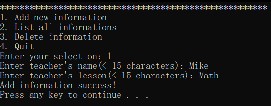
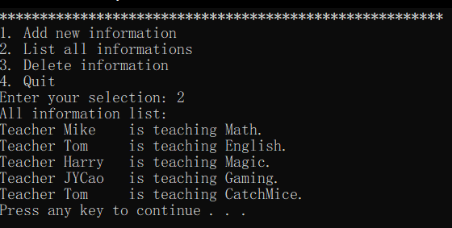
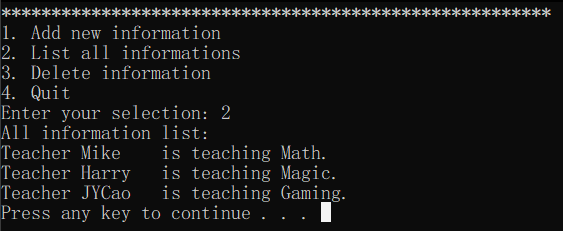

# Simple Teacher Menegement System
## Introduction
Simple Teacher Menegment System is a project based on the C language. It is a homework of softwore foundation lesson.
The program runs on the _command line_. It is divided into two versions: _sequential list_ and _linked list_,and it mainly realizes the following functions:
* Create a list with teachers' names and lessons
* Add teacher into the list
* Show the list
* Delete teacher from the list

Because of my limited level, there are many loopholes in the program writing. Including md documentation and git usage are immature. Please be tolerant.

## Directory Structure
Program is divided into two versions: _sequential list_ and _linked list_. So they are placed in two folders respectively.

```
│   .gitignore
│   README.md
│   
├───Linklist
│       Linklist.c
│       Linklist.h
│       main.c
│       makefile
│       TMS_Linklist.c
│       TMS_Linklist.h
│       
├───Sqlist
│       main.c
│       makefile
│       Sqlist.c
│       Sqlist.h
│       TMS_Sqlist.c
│       TMS_Sqlist.h
```

_Linklist.c_ and _Linklist.h_ are the code of link list. Two files prefixed with _TMS_ are the code includes functions definations and statements not about link list. Files of Sqlist is similar.

## Function demonstration
_Images use Linklist part as demo, but functions of two parts are the same._

Program can run as follows.

### Menu

When you start _run.exe_, you will see this interface.


Then you can select a number to take the appropriate action.

If you select a number out of them(1-4), program will prompt your input error. Otherwise, program only take over one character and part more than one character will be truncated.

### Add Informations
When you Enter _1_ and press _Enter_ in menu, there will be a new line to prompt you to enter the teacher's name you want. Then according to the next prompt you should enter the teacher's lesson.



Program now only allow you to add one item at a time. This is a defact. Maybe it will be perfect in the next sevaral versions.

_p.s. I just found out you can only type one word when adding information, because program uses scanf to get input. The serious defact is also maybe perfected in the next sevaral versions._

### List Informations
When you Enter _2_ and press _Enter_ in menu, a list of information you added will be listed below.



It is a pity that there is not a search function in this version.

### Delete Informations
When you Enter _3_ and press _Enter_ in menu, a list of information you added will be listed below. And you can delete informations based on teacher's name or class or both of them.


Notice that all information that matches the criteria you entered will be deleted. Delete operation is global.



One more thing to notice, in program of Sqlist part, the order of the information will be disrupted after deleting the information. This result is related to the deletion algorithm of my Sqlist.

## About the Program
You can see this program is coded very simple and there are too many defacts in it. On the one hand it is just a homework of software foundation class and I don't want to spend too much time on it, on the other hand my programing level is limited so I can not write perfect code.

_(quietly)You can also see my poor English, it is because I am from China._

The program may be optimized in the future. The above errors will be corrected. 

Comments and suggestions are welcome.
